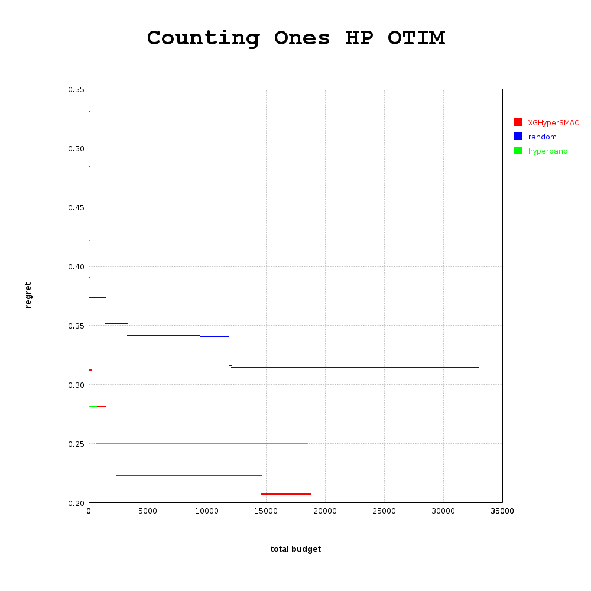
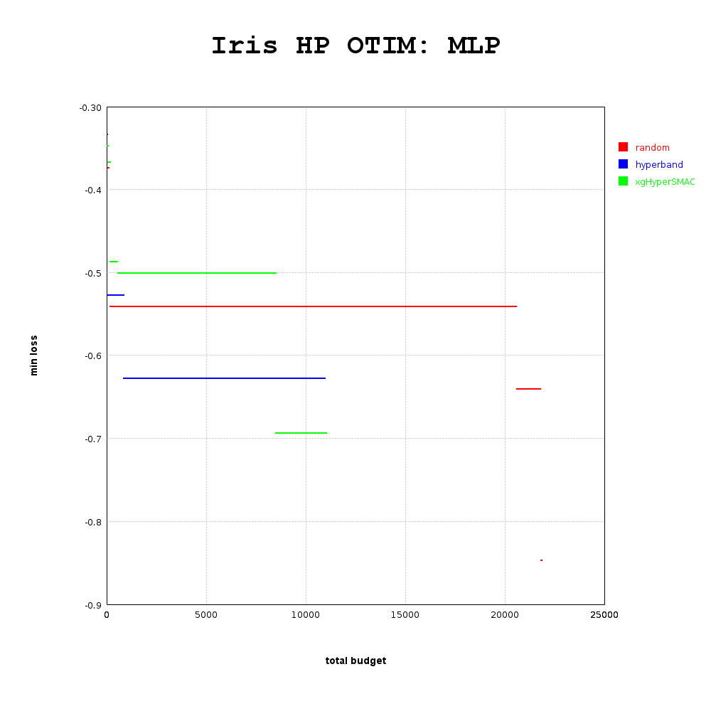

# HyperSMAC
 

Hyperband with SMAC auxiliary optimizer

This library is intended to be a zero-dependency Scala implementation of a hybrid Hyperbandit and SMAC algorithm inspired by Bayesian Optimized Hyperbandit ([BOHB](https://arxiv.org/abs/1807.01774)) as implemented in [HPBandSter](https://github.com/automl/HpBandSter). 

Simalarly as to in  original BOHB paper, we execute a number of benchmarks as part of our CI suite, and compare a reference XG-boost-based XGHyperSMAC algorithm to regular Hyperband as well as random parameter search (2x).

Counting Ones:

Iris Dataset MLP:

This project presents an abstract configuration space which can 
be defined with great flexibility. Additionally, it is intended to be easy to substitute the XG-Boost SMAC algorithm with arbitrary configuration selection models.

Basic usage examples can be found in [test benchmarks](src/test/scala/com/scalasci/hypersmac).

